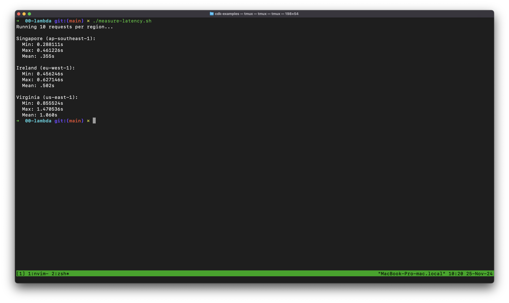

# Lambda Function URL Latency Test

Simple bash script to measure latency across multiple AWS regions by testing Lambda Function URLs. For each region, the script calculates:

- Minimum response time
- Maximum response time
- Mean response time



## Prerequisites

- bash shell
- curl
- bc (basic calculator, usually pre-installed on Linux/Mac)

## Setup

1. Save the script as `measure-latency.sh`

2. Make it executable:

```bash
chmod +x measure-latency.sh
```

3. Update the Lambda URLs in the script to match your deployed functions:

```bash
# Replace these URLs with your Lambda Function URLs
SG_URL="https://your-lambda-url.ap-southeast-1.on.aws/"
EU_URL="https://your-lambda-url.eu-west-1.on.aws/"
US_URL="https://your-lambda-url.us-east-1.on.aws/"
```

You can find your Lambda Function URLs in:

- AWS Console → Lambda → Your Function → Configuration → Function URL
- CDK stack outputs after deployment
- CloudFormation outputs

## Usage

Run the script:

```bash
./measure-latency.sh
```

## Example Output

```
Running 10 requests per region...

Singapore (ap-southeast-1):
  Min: 0.231s
  Max: 0.432s
  Mean: 0.315s

Ireland (eu-west-1):
  Min: 0.156s
  Max: 0.298s
  Mean: 0.203s

Virginia (us-east-1):
  Min: 0.089s
  Max: 0.198s
  Mean: 0.134s
```

## Customization

To modify the number of requests, change the `REQUESTS` variable in the script:

```bash
# Number of requests per region
REQUESTS=10  # Change this value
```

## Note

Response times will vary based on your geographical location and network conditions.
